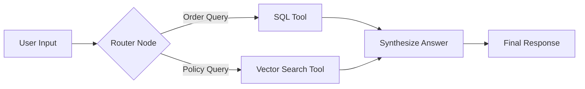

# 🤖 FutureSmart AI: Intelligent Support Agent

> **Submission for AI Intern Role (Vibe Coding Challenge)** > A production-ready **Agentic Workflow** built with **LangGraph**, **FastAPI**, and **Vector Search**.

## 📖 Overview
This project is an autonomous customer support agent designed to handle **hybrid queries**. It intelligently routes user requests to the correct data source:

1.  **Structured Data (SQL):** Checks real-time order status (e.g., "Where is my order?").
2.  **Unstructured Data (Vector DB):** Answers questions about policies using RAG (e.g., "What is the refund policy?").

Unlike simple chatbots, this agent uses **LangGraph** to maintain state, decide which tools to call, and manage conversation memory.

---

## 🧠 Architecture
The agent is built as a state graph that routes between tools based on user intent.

🛠️ Tech Stack
Component,Technology,Description
Orchestration,LangChain & LangGraph,Stateful agent management and tool routing.
LLM,Llama-3.3-70B,High-speed inference via Groq API.
Embeddings,HuggingFace,"all-MiniLM-L6-v2 (Local, Free & Privacy-focused)."
API,FastAPI,Asynchronous web server for the chat interface.
Database,SQLite & ChromaDB,Hybrid storage for Order Transactions (SQL) and Documents (Vector).

📂 Project Structure
ai_support_agent/
├── app/
│   ├── server.py       # FastAPI entry point
│   ├── graph.py        # LangGraph logic (The Brain)
│   ├── tools.py        # Tool definitions (SQL & Vector wrappers)
│   └── state.py        # State schema
├── data/               # Local databases (GitIgnored)
├── scripts/
│   └── setup_data.py   # Database seeder script
├── .env                # API Keys
├── requirements.txt    # Dependencies
└── README.md           # Documentation

🚀 How to Run Locally
1. Clone the Repository
git clone [https://github.com/YOUR_GITHUB_USERNAME/future-smart-ai-intern-task.git](https://github.com/YOUR_GITHUB_USERNAME/future-smart-ai-intern-task.git)
cd future-smart-ai-intern-task
2. Set Up Virtual Environment
# Windows
python -m venv .venv
.venv\Scripts\activate

# Mac/Linux
python3 -m venv .venv
source .venv/bin/activate
3. Install Dependencies
pip install -r requirements.txt
4. Configure Environment Variables
Create a .env file in the root directory and add your Groq API key:
# Get a free key from [https://console.groq.com](https://console.groq.com)
GROQ_API_KEY=gsk_your_actual_key_here
5. Initialize Databases
python scripts/setup_data.py
Output: ✅ Data setup complete!
6. Start the Server
uvicorn app.server:app --reload
The API will be available at: http://127.0.0.1:8000

🧪 Testing the Agent
You can test the API using the built-in Swagger UI.

Go to http://127.0.0.1:8000/docs.

Click POST /chat -> Try it out.

Test Case A: Check Order Status (Uses SQL)
The agent will detect an order ID and query the SQLite database.

Request Body:

JSON

{
  "message": "Where is my order ORD-123?",
  "thread_id": "user_session_1"
}
Response:

"Order ORD-123 containing 'Gaming Laptop' is currently: Shipped"

Test Case B: Refund Policy (Uses Vector Search)
The agent will perform semantic search on the policy documents.

Request Body:

JSON

{
  "message": "What is the refund policy for electronics?",
  "thread_id": "user_session_1"
}
Response:

"Refunds are processed within 7 business days. No refunds on electronics after 30 days..."
